# XDCD Usage in Lectures

## SE1

1. Introduction

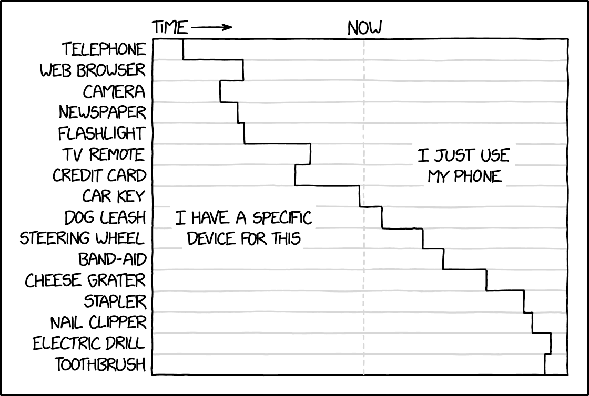

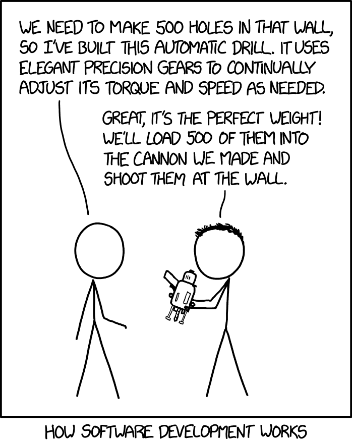

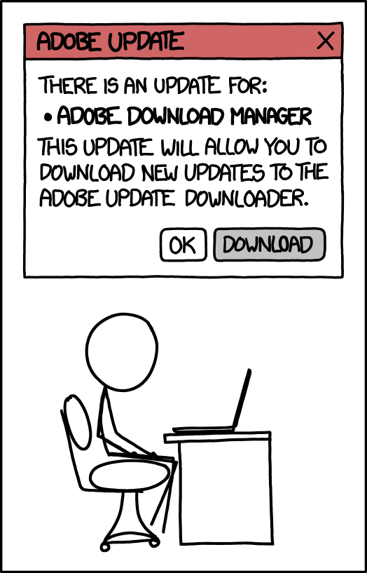

2. Implementation

3. Testing

4. Software Changes

5. Version Control

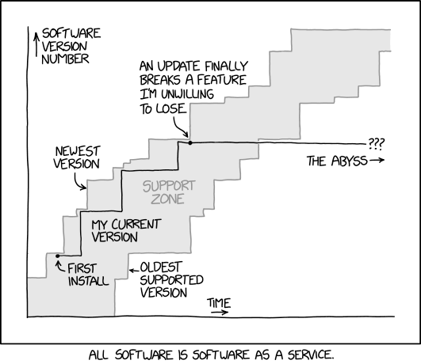

6. Project Management

7. Development Process

8. Requirements

9. System Modeling

10. Software Architecture

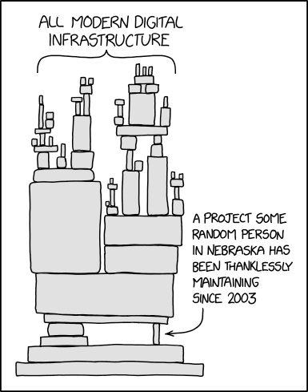

11. Software Design

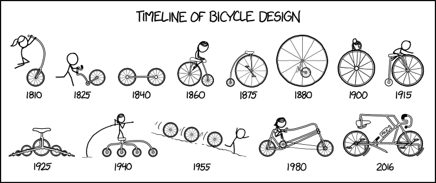

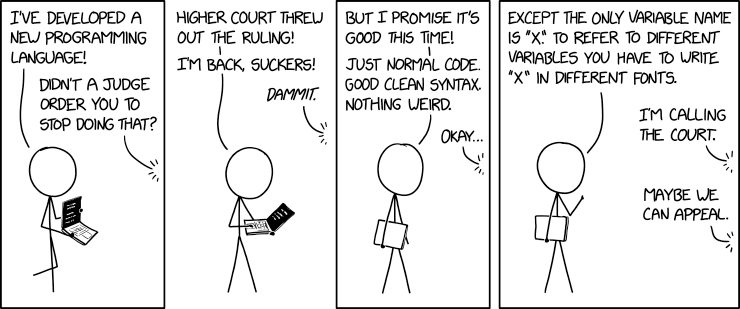

12. Software Reuse

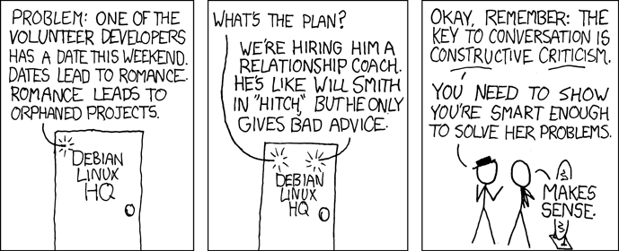

## SE2

1. Introduction

2. Evolution

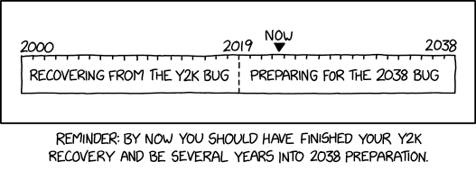

3. Maintenance

4. Design Patterns

5. Compilation

6. Static Analysis

7. Dynamic Analysis

8. Design by Contract

9. Configuration Management

10. Open-Source Software

11. Software Product Lines

12. Automotive Software

## SPL

1. Introduction

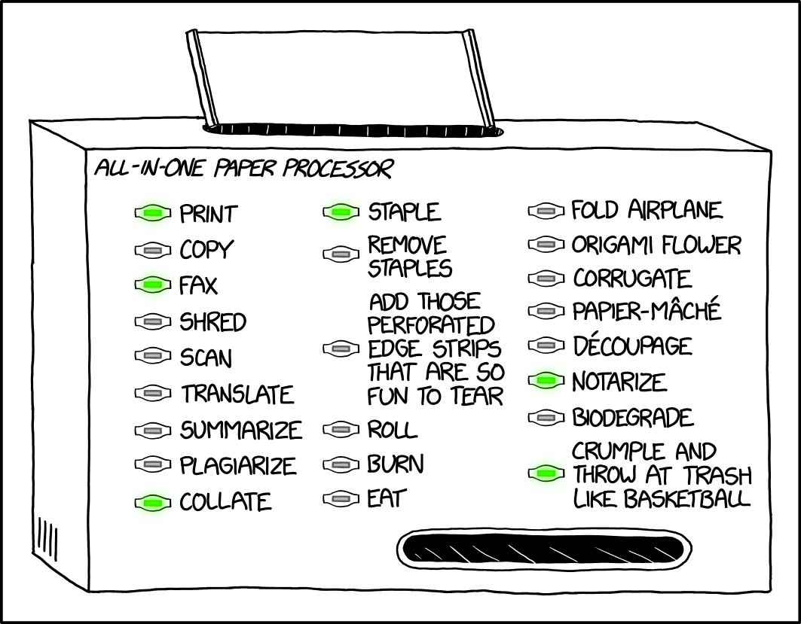

2. Runtime Variability and Design Patterns

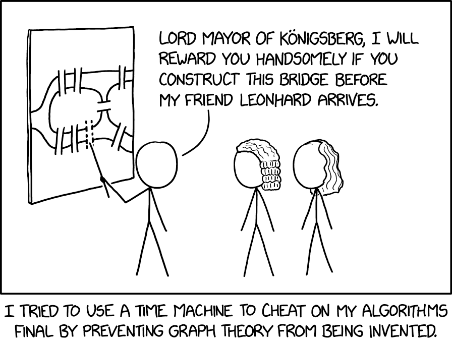

3. Compile-Time Variability with Clone-and-Own

4. Feature Modeling

5. Conditional Compilation

6. Modular Features

7. Languages for Features

8. Development Process

9. Feature Interactions

10. Product-Line Analyses

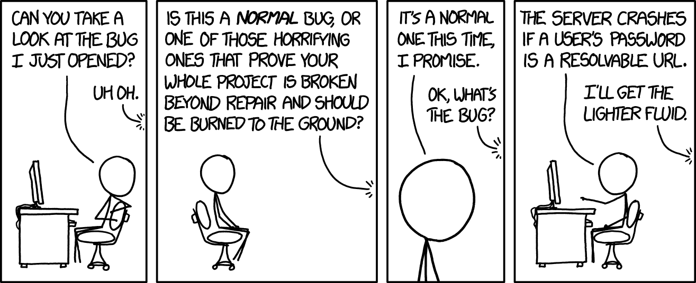

11. Product-Line Testing

12. Evolution and Maintenance

## Unused XKCDs

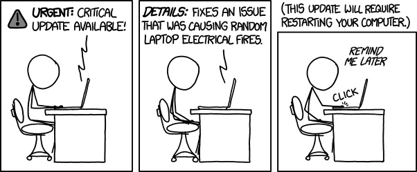

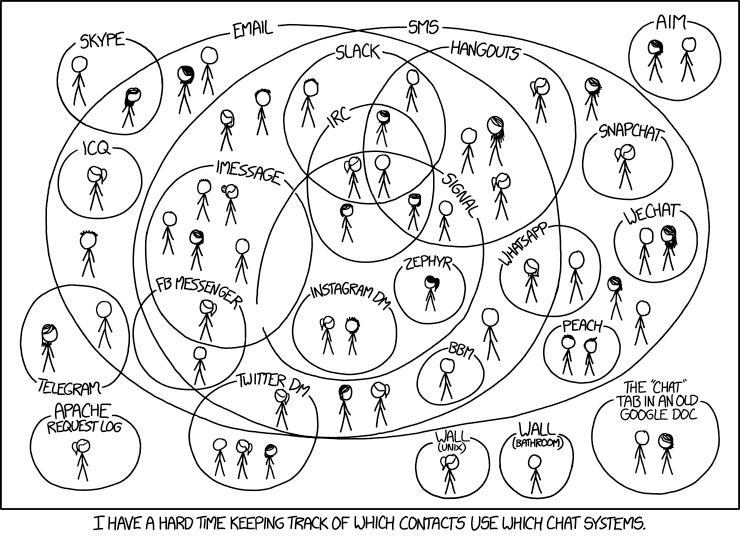

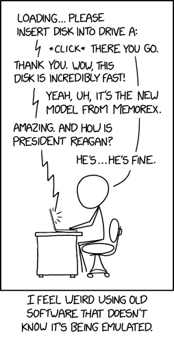

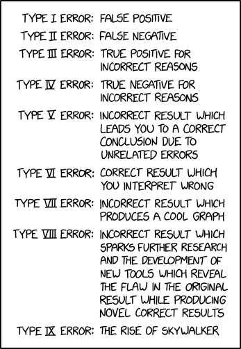

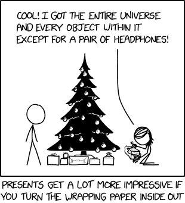

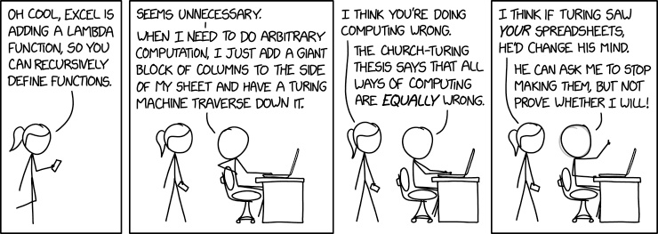

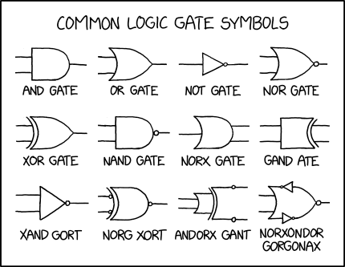

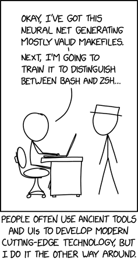

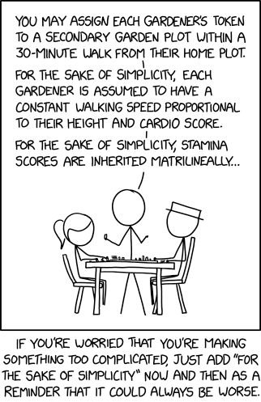

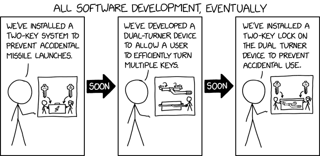

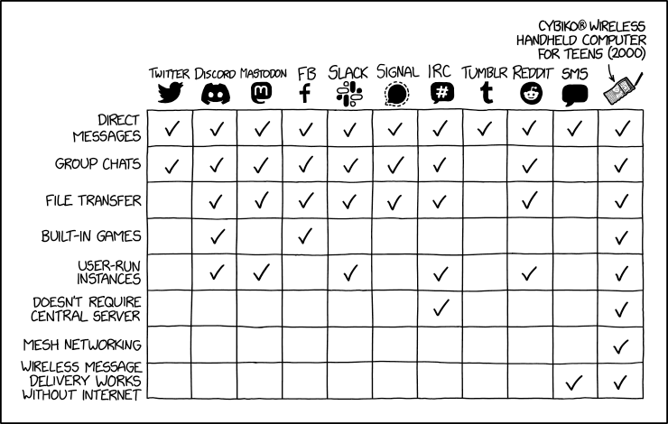

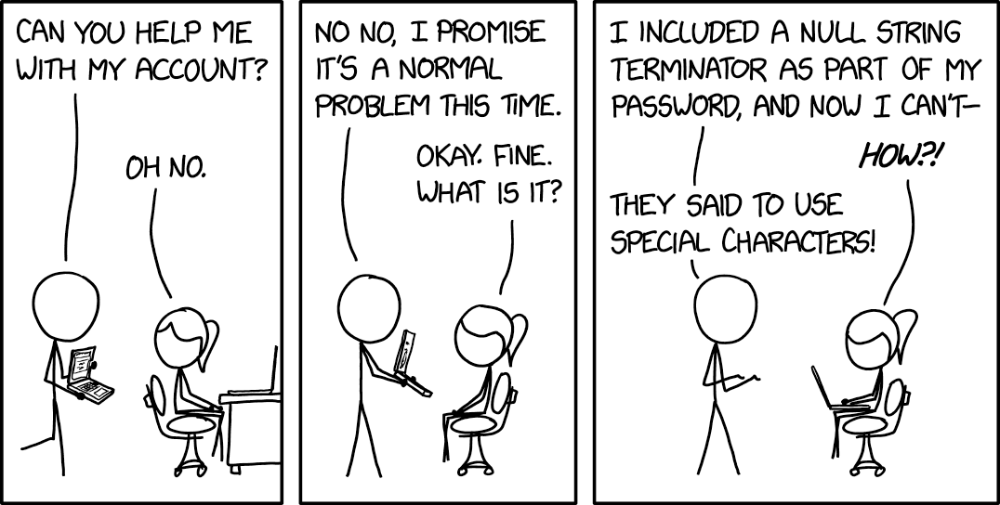

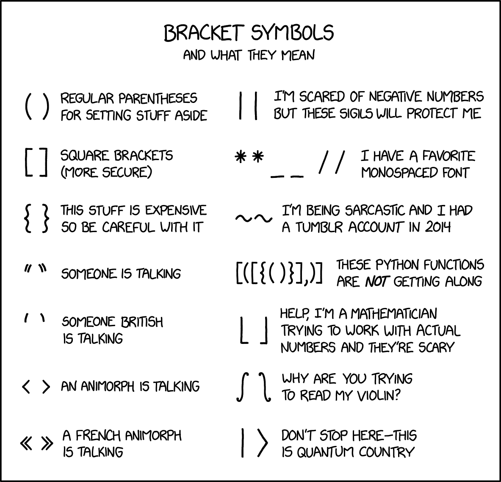

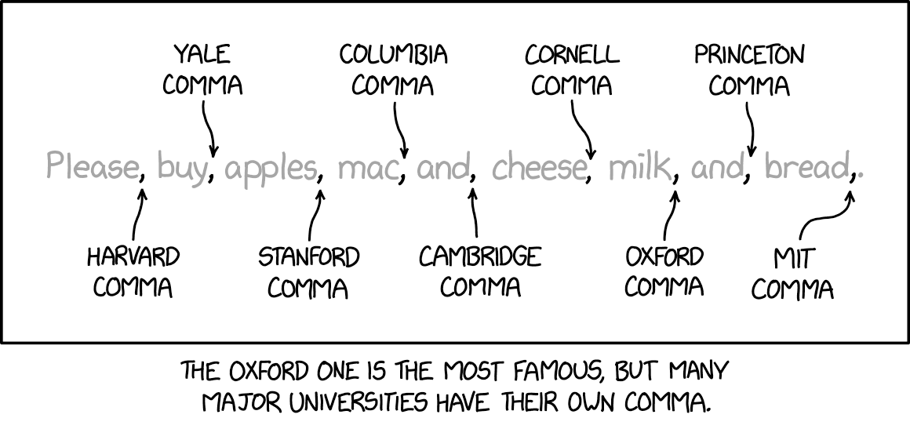

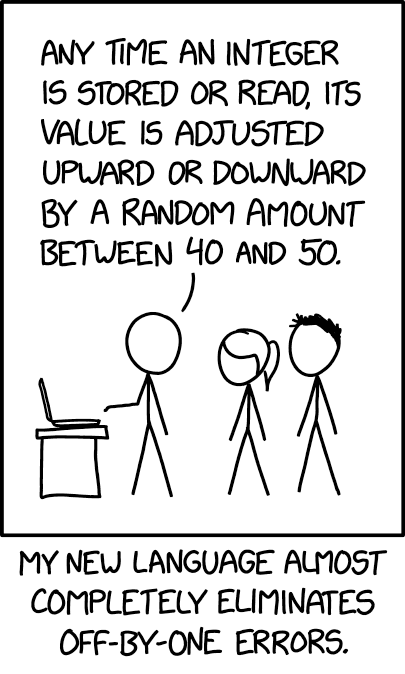

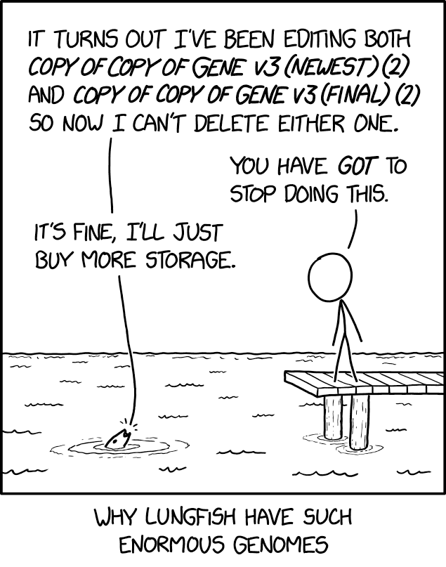

